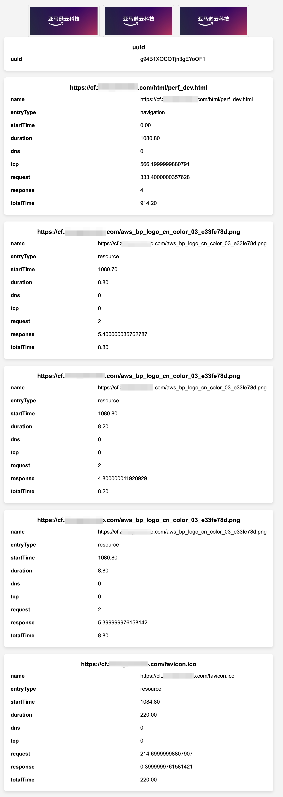

<p align="center">
    【<a href="README.md">中文</a> | English】
</p>

## 1. Background

Users occasionally experience slow resource loading when opening web pages. This issue can be caused by various factors, including slow network speeds, distant CDN nodes, or slow response times from the origin server.  
When debugging such problems, a complete trace from the user’s side to the origin server is often needed. In AWS CloudFront, all requests reaching the CloudFront POP are logged, making it possible to query related logs. However, metrics related to user-side loading (e.g., DNS resolution time, TCP connection time, request time, response time, etc.) are not recorded at the POP and must be collected on the user’s side. Typically, `curl` is used to collect these metrics, but most end users lack the tools or skills to execute `curl` commands on the command line. Thus, a convenient tool is required to allow users to easily collect and report metrics.

## 2. Tool Description

This project provides two tools:

**Metric Collection and Reporting Tool:**  
This tool uses the browser’s Performance API to collect metrics in a webpage using JavaScript and reports them to a backend. The backend uses API Gateway to expose an API endpoint, processes the reports using Lambda, and stores the data in DynamoDB.

**Data Visualization Tool:**  
A Python-based tool developed with Streamlit to query and visualize user-reported data for analysis.

## 3. Deployment Steps

### 1) Create a DynamoDB Table  
- **Table Name:** `cdn-perf-reports`  
- **Partition Key:** `uuid` (String)  
- **Capacity Mode:** On-demand  

### 2) Create a Lambda Function  
- **Runtime:** Python 3.12  
- **Code:** Copy the code from `lambda_function.py`.  
- **Execution Role:** Ensure the Lambda function has permission to write to DynamoDB:  

```json
{
    "Version": "2012-10-17",
    "Statement": [
        {
            "Effect": "Allow",
            "Action": [
                "dynamodb:PutItem"
            ],
            "Resource": [
                "arn:aws:dynamodb:<region>:<account-id>:table/cdn-perf-reports"
            ]
        }
    ]
}
```

### 3) Create an API Gateway  
- **Type:** HTTP API  
- **Route:** `/report/{uuid}` with method `POST`  
- Integrate the route with the Lambda function using Payload Format Version 2.0.  

### 4) (Optional) Deploy a Subdomain in Route53 to Record Resolver Information  
1. Create a hosted zone in Route53 for a subdomain, e.g., `perf.example.com`, and configure a **Query Logging Configuration** for the hosted zone to enable query logs.  
2. Add a record to the hosted zone:  
   - **Record Name:** `*.perf.example.com`  
   - **Record Type:** `A` or `CNAME`  
3. The performance page will use a generated `uuid` to create a unique domain, e.g., `asddfg123.perf.example.com`, and trigger DNS resolution by sending a GET request to this domain.  

### 5) Modify `perf.html`  
- Update the `reportUrl` to your API Gateway endpoint.  
- Update `imageUrls` to point to images served via the CDN (ensure the domain matches the one loading `perf.html`).  
- Deploy `perf.html` to an accessible origin (server or S3 bucket). Optionally, distribute it via CDN.  
- (Optional) Update `r53Url` to a test domain URL, e.g., `https://uuid.perf.example.com/test.jpg`.  

### 6) Deployment Complete  
Visit the URL of `perf.html`. The page will display collected metrics. You can also query the reported metrics in DynamoDB using the `uuid` displayed on the page.  



## 4. Data Visualization Tool  

The visualization tool can be run locally or on an EC2 instance, enabling easy querying and display of data.  

Steps to Run:  
1. Ensure local or EC2 instances have DynamoDB query permissions.  
2. Install Python 3.12 and run the following commands:  

```bash
pip install streamlit plotly pandas boto3
streamlit run app.py
```

3. Query data using the `uuid` (Route53 query logs may take up to five minutes to appear).  

The tool interface appears as follows:  


## 5. Additional Notes  
This tool is designed for debugging rather than routine metric collection. Use it only when necessary.  
The tools can be deployed server-side. When issues are reported by users, send them the page link. The page will automatically collect and report metrics upon user interaction.  

## 6. References  
- [Resource Timing API](https://developer.mozilla.org/en-US/docs/Web/API/Performance_API/Resource_timing)  
- [Navigation Timing API](https://developer.mozilla.org/en-US/docs/Web/API/PerformanceNavigationTiming)  
- [Paint Timing](https://developer.mozilla.org/en-US/docs/Web/API/PerformancePaintTiming)  