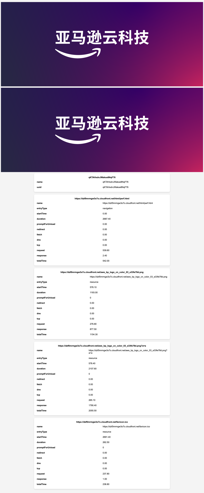

<p align="center">
    【中文 | <a href="README-EN.md">English</a>】
</p>
## 1. 背景说明
用户在打开网页的时候，时不时会出现资源加载速度慢的问题，此问题可能由多种原因引发，包括但不限于：网速差，CDN节点调度太远，源站响应速度慢等。  
在Debug问题的时候，往往需要从用户侧到源站的完整链路日志。在AWS Cloudfront中，所有到达cloudfront POP点的请求日志都会被记录，以便查询相关日志信息，但是用户侧的相关加载指标（DNS解析时间，TCP建连时间，请求时间，响应时间等）POP点无法记录，需要在用户侧收集。一般方法是使用curl来获取各项指标，但是对于终端用户来说，大多数用户并没有能力和工具在命令行执行curl命令，所以需要一个便捷的工具让用户可以方便的进行指标收集和上报。  

## 2. 工具说明
本工具基于浏览器提供的Performance API ，在网页中使用JS来获取各项指标，并且上报到服务端。服务端使用APIGateway暴露上报API，使用Lambda处理上报请求，将数据存储在DynamoDB中。

## 3. 部署步骤

### 1) 创建DynamoDB表
表名：cdn-perf-reports  
Partition key：uuid (String)  
Capacity mode: On-demand  

### 2) 创建Lambda函数
Runtime: Python 3.12；  
代码复制lambda_funtion.py的代码；  
在 Configuration -> Environment variables 中添加环境变量: TABLE_NAME，值为cdn-perf-reports；  
配置Lambda函数的执行角色，确保其具有写入DynamoDB的权限；  

```
{
    "Version": "2012-10-17",
    "Statement": [
        {
            "Effect": "Allow",
            "Action": [
                "dynamodb:PutItem"
            ],
            "Resource": [
                "arn:aws:dynamodb:<region>:<account-id>:table/cdn-perf-reports"
            ]
        }
    ]
}
```

### 3) 创建API Gateway
类型选择 HTTP API；  
新建route：/report/{uuid} ，method: POST  
将改route与Lambda集成，Payload format version：2.0  

### 4) 修改perf.html
将 report.example.com改为API Gateway地址；  
将页面里image-container中的图片链接改为通过CDN分发的图片地址（域名需要和perf.html加载的域名是同一个）;  
将pert.html放在可访问的源站上（服务器/S3），可通过CDN进行分发；  

### 5) 部署完成
访问perf.html地址，页面中会展示收集到的指标，也可以根据页面中展示出来的uuid，在DynamoDB中查询到上报到服务端到指标信息；  


## 4. 额外说明
此工具设计的初衷是用来Debug问题，而不是作为日常的指标收集方案。所以请只在需要的时候才使用。  
可以将工具部署在服务端，当用户侧反馈有问题的时候，将页面链接发送给用户，用户点击链接后会自动检测和上报相关信息。  

## 5. 相关资料
https://w3c.github.io/resource-timing/  
https://juejin.cn/post/6844904182202253325  
